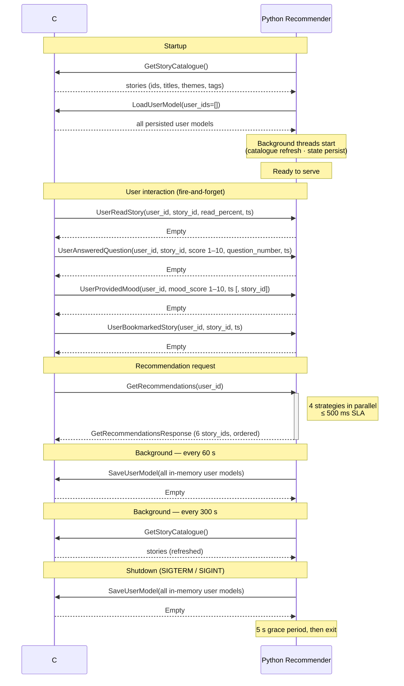

# Story Recommender — Python gRPC Service

A Python recommender system prototype that integrates with a C# app server via gRPC. It tracks user interactions with stories, maintains per-user preference profiles in memory, and returns 6 personalised recommendations within 500 ms.

## Architecture

```
C# App Server ──gRPC──► Python Recommender (this repo)
      ▲                         │
      └────────gRPC─────────────┘
         (story catalogue + state persistence)
```

**Python acts as a gRPC server** — the C# client sends user events and recommendation requests to Python.

**Python also acts as a gRPC client** — it calls back to C# to fetch the story catalogue and persist/load user state.

### Communication flow



### Recommendation slots (6 total)

| # | Strategy | Algorithm |
|---|---|---|
| 2 | Content-based | Cosine similarity: user theme+tag weight vector vs story indicator vectors |
| 2 | Collaborative filtering | User-user cosine similarity; aggregate stories from top-20 similar users |
| 1 | Topical | User's highest-weight tag → best matching unviewed stories |
| 1 | Wildcard | Random, preferring stories in unexplored themes |

#### Slot stability

All 6 slots are recalculated on every call — the result is never returned from cache. If a story from the previous set reappears in the fresh calculation (and the user has not acted on it), it is placed at its original slot index. This keeps the display consistent when the catalogue is nearly exhausted and some stories must be repeated, while still allowing consecutive calls without any interaction to return different stories ("try again").

#### Progressive coverage

The engine fills slots using a four-tier priority system based on each story's **skip count** — how many times it has been recommended without the user viewing it:

| Tier | Condition | Meaning | Priority |
|---|---|---|---|
| 1a — Fresh | `skip_count == 0`, not in last batch | Never recommended, or reset after a view | Highest |
| 1b — Light | `0 < skip_count ≤ 3`, not in last batch | Recommended a few times; still deserves chances | High |
| 2 — Avoid | `skip_count > 3`, not in last batch | User likely selecting away; deprioritised | Low |
| 3 — Last batch | In the most-recent call | Cycling fallback after catalogue exhaustion | Lowest |

The skip count is incremented each time a story appears in recommendations without the user viewing or completing it, and reset to zero on view/complete. This avoids permanently burying a story that the user simply hasn't noticed yet, while gently moving aside stories the user appears to be skipping deliberately.

This guarantees that a user who consistently acts on recommendations will eventually be offered every story in the catalogue. It also ensures that once the catalogue is fully exhausted, consecutive "Get Recommendations" calls continue to cycle through different stories (rotating through Tiers 1b → 2 → 3) rather than repeating the same set indefinitely. Stories are only repeated when the catalogue is smaller than 6 slots.

#### Mood-responsive allocation

The default slot counts above shift based on the user's recent average mood (last 5 entries):

| Recent mood avg | Content | Collaborative | Topical | Wildcard | Rationale |
|---|---|---|---|---|---|
| ≤ 4.0 (low) | 3 | 2 | 1 | 0 | Familiar comfort content; no surprises |
| 4.0–7.0 (neutral / no data) | 2 | 2 | 1 | 1 | Default |
| ≥ 7.0 (high) | 1 | 2 | 1 | 2 | Broader exploration |

Collaborative and Topical slots are held constant because collaborative recommendations surface what similar-mood users enjoy, and the topical slot anchors a known deep interest regardless of current mood state.

### User preference model

Every interaction updates a per-user theme/tag weight vector:

| Event | Weight delta per theme/tag |
|---|---|
| Read ≥ 50% | +1.0 (inferred "viewed"; applied once, idempotent) |
| Read = 100% | +2.0 bonus (inferred "completed", additive with the view weight) |
| Read < 50% | no weight impact; progress noted but not acted on |
| Scored 1–10 (Q1) | `(score − 5) × 0.25` — neutral at 5; score 1 = −1.0, score 10 = +1.25. Q2–Q4 (optional) are analytics-only; no weight effect. |
| Mood 1–10 | attribution feedback: `±(mood_delta / 9) × 0.5` applied to themes/tags engaged since the previous mood event — improvement boosts them, decline dampens (floor 0) |
| Bookmarked | recorded as an analytic event only; no current weight impact |
| Skip (no view) | `skip_count` incremented; story moves toward Tier 2 after > 3 consecutive skips |

"Viewed" and "completed" are no longer separate gRPC events — they are both inferred from `UserReadStory` (`read_percent`). The read-progress thresholds are defined in `user_state.py` (`READ_VIEWED_THRESHOLD_PERCENT = 50`, `READ_COMPLETED_THRESHOLD_PERCENT = 100`).

Mood events (`UserProvidedMood`) accept an optional `story_id`; when present (e.g. when the mood prompt appears at the end of a story), the story's skip count is reset, reflecting that the user engaged with the content fully enough to reach the end-of-story screen.

Mood attribution factor (`MOOD_ATTRIBUTION_FACTOR = 0.5`) means a maximum mood swing of +9 (1 → 10) adds at most half a "viewed" event of extra weight per theme/tag. The transient accumulator that tracks engaged content between mood events is not persisted; it resets on service restart.

### State persistence

User state is persisted to the C# server as a compact **user model** — the already-computed derived state — rather than a raw event log. This keeps the payload size bounded by the size of the story catalogue vocabulary regardless of how many interactions a user has had, making startup and periodic saves scalable to large numbers of users.

The persisted model includes: theme/tag weights, viewed/completed/scored story sets, recent mood scores, the last recommendation set (for slot stability), and the set of all stories ever recommended (for progressive coverage).

## Project Structure

```
proto/                    gRPC service definitions (.proto)
generated/                protoc-generated Python bindings (not committed)
recommender/
  models.py               Story, UserEvent, UserProfile dataclasses
  catalogue.py            StoryCatalogue — fetches & caches stories from C#
  user_state.py           UserStateStore — event ingestion, weights, persistence
  engine.py               RecommendationEngine — orchestrates 6 slots
  service.py              RecommenderServicer — gRPC servicer
  strategies/             Four strategy implementations
main.py                   Entry point — real recommender service
mock_server.py            Mock C# backend + browser test UI (see below)
load_users.py             Synthetic load generator — 100 test users (see below)
capacity_model.py         Persistence capacity estimator — volume & frequency (see below)
config.py                 Environment-variable configuration
tests/                    pytest test suite (206 tests)
```

## Setup

```bash
# 1. Install dependencies
pip install -r requirements.txt

# 2. Generate gRPC Python bindings from the proto file
make proto

# 3. Configure environment (copy and edit)
cp .env.example .env
```

## Running

### With the mock server (no C# required)

`mock_server.py` stands in for the C# backend and provides a browser UI for
interactive testing. Start both processes in separate terminals:

**Terminal 1 — mock backend + web UI:**
```bash
python mock_server.py
```

**Terminal 2 — recommender:**
```bash
python main.py
```

Then open **http://localhost:8080** in a browser.

| Port | Process | Role |
|---|---|---|
| `50052` | `mock_server.py` | StoryService gRPC (acts as C# backend) |
| `50051` | `main.py` | RecommenderService gRPC |
| `8080` | `mock_server.py` | Browser test UI |

#### Browser UI panels

| Panel | Description |
|---|---|
| **Story Catalogue** | 27 sample Oxford museum stories — click Q1–Q4, Mood, Read%, or Bookmark to fire events |
| **Recommendations** | 6 recommended stories returned by the engine after clicking "Get Recommendations" |
| **Preference Weights** | Live bar chart of theme/tag weights, updated after every interaction |
| **Event Log** | Timestamped record of every event fired for the selected user |

Use the user selector (alice, bob, charlie, diana, test_user, or a custom ID) to
switch between users and observe how different interaction histories produce
different recommendations, and how the collaborative strategy responds once
multiple users have built up histories.

**Event ordering:** Story button clicks (Q1–Q4, Mood, Read%, …) fire asynchronous
gRPC calls but are serialised through a Promise queue before the "Get Recommendations"
call is dispatched. This means clicking several buttons and then immediately clicking
"Get Recommendations" is safe — the recommendations will reflect all preceding events.
API responses also carry `Cache-Control: no-store` so the browser always fetches a
fresh result.

If you get `OSError: [Errno 48] Address already in use`, a previous process is
still holding a port. Free it with:
```bash
kill $(lsof -ti :8080 -ti :50052) 2>/dev/null
```

### Synthetic load generator (`load_users.py`)

`load_users.py` populates the recommender with realistic interaction histories
for up to 100 synthetic users (`load_user_001` … `load_user_N`), making the
collaborative-filtering strategy meaningful right away.

Each user is assigned a randomly-generated but **consistent** preference profile:
theme weights drawn from a right-skewed Beta distribution (so each user has a
handful of strong interests and mostly ignores the rest).  An overall engagement
factor controls how many stories the user interacts with.

| Event | Probability / value |
|---|---|
| Read ≥ 50% | `engagement × (0.05 + 0.95 × theme_pref)` — inferred as "viewed" |
| Read% | 70 % of reads; amount ∝ preference (triangular distribution) |
| Read 100% | `pref² × engagement × 0.8` — only strongly preferred stories; inferred as "completed" |
| Scored 1–10 | 80 % of completions; score ~ N(1 + pref × 9, 0.8), clamped to [1, 10] |
| Mood 1–10 | 1 per reading session (3–7 stories); score correlates with session's avg preference, so the recommender's mood-attribution mechanism sees realistic signal |

Stories are sorted chronologically and grouped into sessions before sending, so each mood event arrives at the recommender *after* the story events it should be attributed to. Interactions are spread across a 60-day window so the timestamps are realistic.

**Run with mock server already started (Terminal 1 + 2 above):**
```bash
# Terminal 3 — generate events for 100 users
python load_users.py

# Fewer users for a quick test
python load_users.py --users 20

# Fully reproducible run (same seed → same interaction histories)
python load_users.py --seed 42

# Also fetch recommendations for each user at the end
python load_users.py --recs

# Remote recommender
python load_users.py --addr host:50051
```

After running, switch between `load_user_001` … `load_user_100` in the browser
UI's user selector to inspect individual Preference Weight profiles and see how
the collaborative-filtering strategy groups similar users.

### Persistence capacity estimator (`capacity_model.py`)

`capacity_model.py` models the volume and frequency of `UserModel` state saves
and loads between Python and the C# backend.  It is a standalone script with no
server required — edit the **PARAMETERS** section at the top and run it to get
four formatted tables instantly.

```bash
# Analytical tables only (no proto bindings needed)
python capacity_model.py

# With empirical proto measurement (run make proto first)
make proto && python capacity_model.py
```

#### What the four tables show

| Table | Shows |
|---|---|
| **1 — Per-user state size** | Estimated proto wire size for fresh / typical / mature user profiles |
| **2 — Scale volumes** | Total state, save payload per flush, and startup load time across small / medium / large deployments |
| **3 — Save bandwidth matrix** | Sustained bytes/sec for each deployment scale × flush interval combination |
| **4 — Dirty-flag optimisation** | How much bandwidth a per-user dirty flag would save vs the current design (where all in-memory users are saved on every flush) |

The empirical section constructs real `UserModelMessage` proto messages for each
maturity band, serialises them, and compares the wire size against the analytical
formula — a useful sanity check when the catalogue vocabulary or story-ID format
changes.

#### Key parameters to set before running

| Parameter | Default | What to change it to |
|---|---|---|
| `N_STORIES` | `27` | Your production catalogue size |
| `N_THEMES` / `N_TAGS` | `10` / `40` | Vocabulary sizes from your schema |
| `AVG_STORY_ID_BYTES` | `8` | Length of your production story IDs |
| `SCALES` | small / medium / large | Your target user counts |
| `FLUSH_INTERVAL_S` | `60` | Match `STATE_PERSIST_INTERVAL_SECONDS` in config |
| `RPC_LATENCY_MS` / `NETWORK_BW_MBPS` | `10` / `100` | Your network characteristics |

`DIRTY_FRACTION` (default `1.0`) models the current "save all users on every
flush" behaviour.  Lower it to see what a dirty-flag optimisation would save.

### With a real C# server

```bash
# Start the recommender (points at your C# server)
CSHARP_SERVER_ADDRESS=<host>:50052 python main.py
```

## Testing

```bash
# Run all tests
pytest tests/

# With coverage report
pytest --cov=recommender tests/
```

## Configuration

All settings are driven by environment variables. See `.env.example` for the full list.

| Variable | Default | Description |
|---|---|---|
| `GRPC_SERVER_HOST` | `0.0.0.0` | Python gRPC listen address |
| `GRPC_SERVER_PORT` | `50051` | Python gRPC listen port |
| `CSHARP_SERVER_ADDRESS` | `localhost:50052` | C# server address |
| `GRPC_MAX_WORKERS` | `10` | gRPC thread pool size |
| `CATALOGUE_REFRESH_INTERVAL_SECONDS` | `300` | How often to refresh the story catalogue |
| `STATE_PERSIST_INTERVAL_SECONDS` | `60` | How often to persist user state to C# |

## gRPC Interface

### RecommenderService (Python as server — C# calls these)

All requests carry `user_id` (string) and `timestamp` (UTC). There is no concept of a user session; state is saved periodically by a background thread.

```protobuf
rpc UserAnsweredQuestion(...)  returns (Empty);   // fire-and-forget (score 1–10; question_number 1–4)
rpc UserProvidedMood(...)      returns (Empty);   // fire-and-forget (mood_score 1–10; optional story_id)
rpc UserReadStory(...)         returns (Empty);   // fire-and-forget (read_percent 0–100; ≥50% = viewed, 100% = completed)
rpc UserBookmarkedStory(...)   returns (Empty);   // fire-and-forget (analytic only, no rec effect)
rpc GetRecommendations(...)    returns (GetRecommendationsResponse);  // ≤500ms
```

### StoryService (Python as client — Python calls C#)

```protobuf
rpc GetStoryCatalogue(...)  returns (GetStoryCatalogueResponse);
rpc SaveUserModel(...)      returns (Empty);
rpc LoadUserModel(...)      returns (LoadUserModelResponse);
```

`StoryMessage` carries `story_id`, `title`, `themes` (exactly one per story), `tags` (free-text), and `authors` (display names of the story's author(s)).

Full message definitions are in [`proto/recommender.proto`](proto/recommender.proto).

## Regenerating gRPC Bindings

```bash
make proto
```

This runs `grpc_tools.protoc` and outputs `generated/recommender_pb2.py` and `generated/recommender_pb2_grpc.py`. These files are not committed to the repository.

## Dependencies

- `grpcio` / `grpcio-tools` — gRPC transport and code generation
- `protobuf` — Protocol Buffers runtime
- `numpy` — cosine similarity computations (no heavy ML framework needed at this scale)
- `pytest` / `pytest-cov` — testing
